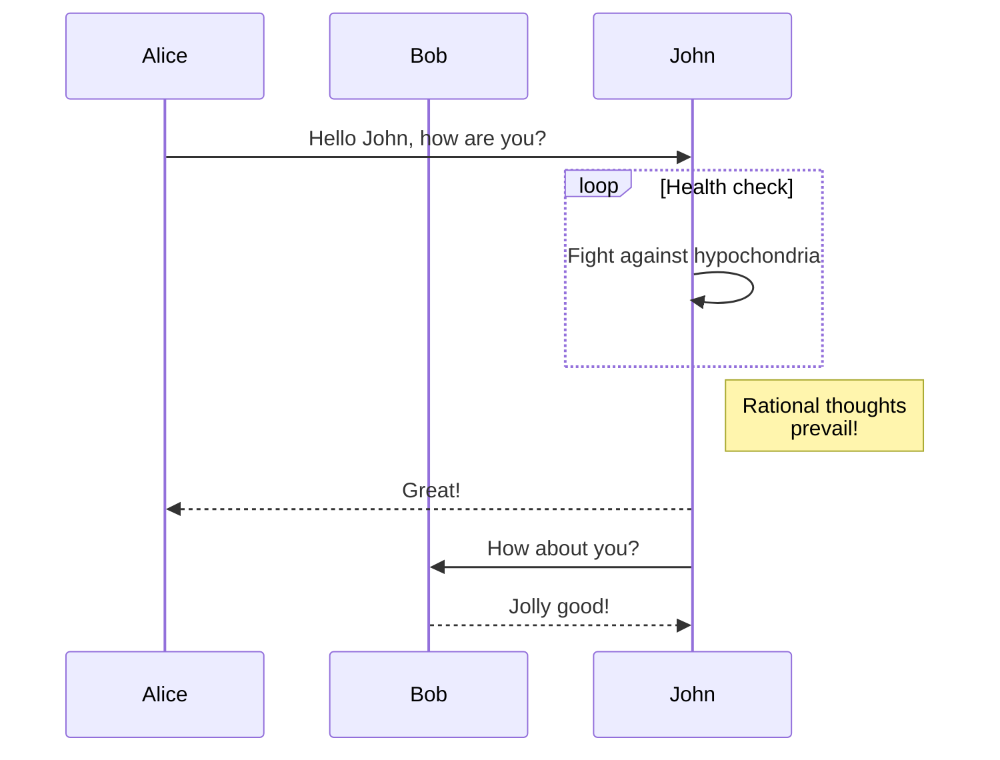

# 博客

:::tip

加油~
:::

## 网站

算法可视化：[https://algorithm-visualizer.org/branch-and-bound/binary-search](https://algorithm-visualizer.org/branch-and-bound/binary-search)

egghead学习网站: [https://egghead.io/](https://egghead.io/)

浏览器支持查询：[https://caniuse.com/](https://caniuse.com/)

百度脑图：[https://naotu.baidu.com/](https://naotu.baidu.com/)

趣味网站：[https://neal.fun/](https://neal.fun/)

图片压缩：[https://tinify.cn/](https://tinify.cn/) 

漫版流程图：[https://excalidraw.com/](https://excalidraw.com/)

最好的框架与库：[https://bestofjs.org/](https://bestofjs.org/)

parceljs：[https://parceljs.org/](https://parceljs.org/)

接口調試：[https://hoppscotch.io/](https://hoppscotch.io/)

## 书籍
- 《你不知道javascript》
- 《webpack实战：入门-进阶-调优》
-  《Node.Js+Webpack 开发实战》
- 《Koa 开发：入门，进阶与实战》
- 《深入浅出Node.js》
- 《Three.js开发指南》
## 文章

[https://zhuanlan.zhihu.com/p/465197334](https://zhuanlan.zhihu.com/p/465197334)

TS高级类型工具：[https://juejin.cn/post/6994102811218673700#comment](https://juejin.cn/post/6994102811218673700#comment)
## 相关技术
- node.js
- next.js
- Svelte.js 
- Vite 
- Accessibility 
- Typescript
- Frameworks
- PWA (渐进式网络应用)
- WebAssembly 
- Serverless 
- Bulma
- Tailwind
- Flutter
- Electron
- Websites
- DevOps
- GraphQL
- WebRTC

区块链的 DApps？可以查看此存储库：
GitHub logo ruppysuppy / Crypto-Crowdfund

